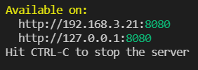

# soul_knight

## :memo: Descrição
Landing page sobre um jogo mobile chamado Soul Knight


## :hammer_and_wrench: Rodando o projeto
O projeto já está disponível online. Basta visitar a url https://brendobc.github.io/soul_knight/

Mas caso queira rodar localmente, execute o seguinte comando:
```
npm run build-sass-prod
```

Em seguida, execute também:
```
npm start
```

Você verá algo assim no terminal: <br>
 <br>
É possível acessar o site por qualquer uma das URLs

E tudo pronto! Para interromper a execução, basta pressionar ```Ctrl + C``` no terminal.


## :computer: Tecnologias utilizadas
#### Sass (Pré-processador css) :nail_care:
* Traz uma sintaxe agradável e funcionalidades mais robustas para facilitar a escrita de código css
* [Guia de instalação](https://sass-lang.com/install)

#### Http-server (servidor) :speech_balloon:
* Cria um servidor na máquina para que hospede o projeto
* Este servidor é importante porque o navegador impede que os sites que estão abertos façam requisições para a sua máquina local por questões de segurança. Se não tivessemos este servidor, o nosso site não conseguiria acessar o próprio javascript, assim teríamos apenas uma página completamente estática!
* [Guia de instalação](https://www.npmjs.com/package/http-server#installation)


## :thought_balloon: Implementação futura
* Descrições reais
* Nova seção de pets
* Carrousel na seção de 'buffs'


## :traffic_light: Status do projeto
On air!
Existem algumas melhorias, mas o "mvp" está pronto.
